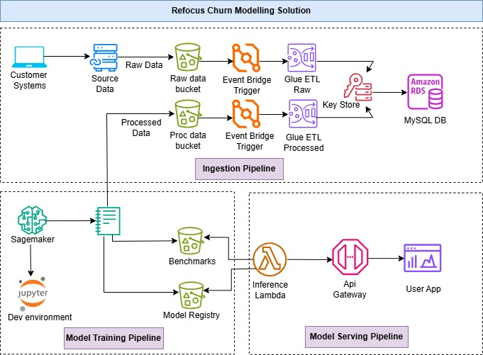

## insurance-churn

This repository contains the code for an end-to-end implementation of a churn modelling solution on AWS cloud. 

The architecture diagram is shown below:

There are three main components to the architecture which are explained below:

### Data Ingestion Pipeline:
The data ingestion process happens in an automated pipeline as soon as raw data arrives in a S3 bucket. Through EventBridge events this triggers an AWS Glue workflow which extracts, transforms and loads data in a MySQL database hosted in AWS RDS. Additionally, AWS Secrets Manager is used as a keyvault to store database credentials.

The second component of the ingestion pipeline is another AWS Glue workflow which is triggerred when cleaned and processed data from the Machine Training pipeline arrives in the S3 bucket.

### Machine Learning Training Pipeline: 
The machine learning pipeline is hosted in an Amazon Sagemaker Workspace in a Jupyter development evironment. 
The jupyter environment also serves as a training and experimentation workspace, where I have developed data processing and modelling experiment notebooks.

Finally, the train_eval_deploy notebook acts as the retraining pipeline which is run as a scheduled notebook job each day. Upon running, the following steps are taken:

It processes the latest raw data from S3 and stores it as processed data back in S3 for authomated ingestion RDS with AWS glue.

Next, the pipeline trains a series of models with hyperparameter tuning to identify the best model on the latest ingested data.

The best model's performance on this data is compared with the previous best model's performance in a benchmarks file. If the current model has better performance, it is stored in a model registry on S3. Else, the previous model is kept as the best model.

### Model Serving pipeline.

The best model is deployed through a Lambda function and exposed as a Rest API through API gateway. The lambda function was deployed as a container image  lambda function has access to the model registry for loading and deploying the model. 

### Environment Setup

Setup, an S3 bucket with folders for raw data, processed data, benchmarks and model repository. Enable EventBridge events on this bucket for the PutObject event.

For ingestion, create two separate AWS glue jobs for ingestion of raw and processed data by cloning this  repository in AWS glue and setup the relevant python scripts for ingestion from with the required runtime arguments. Create triggers in Eventbridge for these Glue workflows to enable automated ingestion.

The notebooks and scripts are written in Python 3.11. 
To setup the ML development environment for modelling pipeline, clone this repository in AWS sagemaker.

Install the requirements through the requirements.txt file i.e. pip install -r requirements.txt.

Schedule, the train_eval_deploy.ipynb as a notebook job for automated training on schedule.

For the Model serving pipeline, create a lambda function via a container image (so, as to circumvent the package size limit and install additional dependencies) for which the DoockerFile is added in this repository. Create a REST API in AWS API gateway which integrates with this lambda function. 

### Workflow:

1. Trigger the raw ingestion pipeline by uploading data to the raw data bucket.
2. The training job will trigger on its schedule and dump processed data to S3 and the current best model in the model registry.
3. The lambda function pointing to model registry makes the model available as a REST API which can be tested against inputs.

### Notes:

1. The ingestion pipeline and the training pipeline is currently written in Python 3.11 with the PyData stack i.e. (Numpy, Pandas, Scikit-Learn etc.). This was because I created this solution on a trial AWS account and had limited compute credits. In a production pipeline, with higher data volumes, the ingestion and modelling pipelines can be written in PySpark to leverage parallel processing.

2. The scheduled notebook training job can also be deployed as an AWS glue job for fully automated solution. However, usually, training jobs are run either manually or on a schedule as there is a need to analyze incoming data in detail before deploying new model versions and also to cater to any unknown data issues during ingestion.

3. The sample churn dataset from the insurance industry appears to be a synthetic dataset which turns out to be essentially random in exploratory data analysis. The trained models even after hyper-parameter tuning were not performing well. In future work, I'll test this against a real world dataset which should be feasible, since all other infrastructure is already in place.

   

 

 

